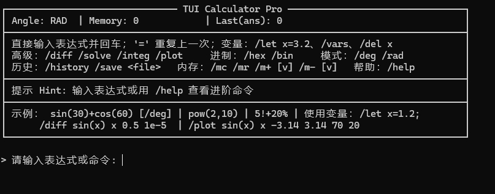

# TUI Calculator Pro (C89)

一个用纯 C89 实现的跨平台终端计算器，支持变量、历史、角度模式、微分/求根/积分、ASCII 曲线绘制以及十六进制/二进制等“进阶功能”。单文件源码：`tui_calc.c`。核心实现基于词法分析 → Shunting Yard 转后缀式（RPN）→ 计算栈，兼容老环境（Dev-C++/旧 MinGW 等）（给我学弟写的作业）。

---

## 快速开始

### 构建

```bash
# Linux / macOS
gcc tui_calc.c -O2 -lm -o calc

# Windows (MinGW / Dev-C++)
gcc tui_calc.c -O2 -o calc.exe -lm
```

程序仅依赖标准库 `<stdio.h> <stdlib.h> <string.h> <ctype.h> <math.h> <errno.h>`；Windows 下会自动启用 ANSI VT 模式以让框线/颜色正常显示。

### 运行

```bash
./calc        # 进入交互式 TUI
./calc --selftest   # 运行内建自测
```

自测会输出 `SelfTest basic: n/n`，覆盖运算优先级、阶乘、百分号、对数/幂等基础用例。

---

## 交互界面与基本用法

启动后会看到顶部状态栏（角度模式/内存/上次结果）和提示区域。直接输入**表达式**回车即可计算；输入等号 `=` 可**重复上一条表达式**。常用示例：
`sin(30)`（需 /deg）、`pow(2,10)`, `5!`, `50%`（等于 0.5）。

**支持的运算与函数**

* 运算符：`+  -  *  /  ^  !  %`，括号 `()`，以及一元负号。优先级从高到低依次为 `!`/`%`（后缀）> 一元负号 > `^`（右结合）> `* /` > `+ -`。因此 `-3^2` 结果为 `-9`，而 `(-3)^2` 为 `9`。
* 函数（1 参）：`sin cos tan asin acos atan sqrt ln log abs exp`；（2 参）：`pow(a,b)`。
* 角度模式：`sin/cos/tan` 接受当前模式的角度；反三角函数输出亦会按模式转换。默认 **RAD**，可用命令切换 DEG。
* 百分号与阶乘：`x%` 等于 `x*0.01`；`n!` 使用 `exp(lgamma(n+1))` 实现，要求 `n` 为 `[0..170]` 的整数。

**变量与常量**

* 预置：`pi`, `e`, `ans`（上次结果）。每次成功计算都会刷新 `ans`。
* 变量名：由**字母或下划线**组成（实现中未接受数字字符），最多 15 字符。最多保存 64 个变量。

---

## 命令一览

在提示符输入以 `/` 开头的命令（输入 `/help` 可查看简表）。以下为常用命令与示例：

### 模式与内存

* `/deg`、`/rad`：切换角度模式。
* `/mc` 清空内存；`/mr` 读出内存到结果与 `ans`；`/m+ [v]`、`/m- [v]` 累加/累减（省略参数则使用上次结果）。

### 变量

* 赋值：

  ```text
  /let x= 1.2+3
  /let k  pow(2,10)
  ```

  查看/删除：`/vars`（按回车返回）、`/del x`。将 `ans` 赋值也会同步“上次结果”。

### 历史

* `/history` 查看最近 50 条记录（按回车返回）。
* `/save result.txt` 保存历史到文件。

### 数值计算（基于表达式与变量名）

* **数值微分**（中心差分，默认 `h=1e-5`）：
  `/diff <expr> <var> <x0> [h]`
  例：`/diff sin(x) x 0.5 1e-5`。
* **求根**（牛顿法，导数用中心差分 `h=1e-6`，默认 `maxit=30 tol=1e-10`）：
  `/solve <expr> <var> <x0> [maxit tol]`
  例：`/solve cos(x)-x x 1.0`。
* **定积分**（Simpson，段数 `n` 自动取偶，默认 `n=200`）：
  `/integ <expr> <var> <a> <b> [n]`
  例：`/integ sin(x) x 0 3.14159 400`。
* **ASCII 曲线绘制**（自动标轴与范围预估，`W∈(0..120]`, `H∈(0..40]`，默认 `60x20`）：
  `/plot <expr> <var> <xmin> <xmax> [W H]`
  例：`/plot sin(x) x -3.14 3.14 70 20`。

### 进制

* `/hex <n>` 输出十六进制（无符号长整型）。
* `/bin <n>` 输出二进制（去除前导零，0 特判）。

### 退出

* `/quit` 退出程序。

---

## 表达式语法速查

* **数字**：十进制/浮点，使用 `strtod` 解析，并检测溢出。
* **标识符**：连续的字母或下划线（用于变量或函数），函数名集合固定。
* **逗号**：仅用于多参函数（目前为 `pow`），由 Shunting-Yard 在括号内处理。
* **错误提示**：如“除零错误”“域/范围错误”“括号不匹配”等会在状态行显示，并写入历史。

实现采用 **Shunting-Yard** 将中缀转 RPN，并用 1024 深度的操作符/数据栈计算；单行最大长度 512，最大 Token 数 1024。

---

## 设计细节与边界

* 三角函数会在进/出时按模式做弧度↔角度转换；`sqrt/ln/log` 等对非法自变量给出明确报错。
* 阶乘限定 `0..170`（避免溢出），非整数会报错；百分号为**后缀运算符**。
* 牛顿法若导数接近 0 或未收敛，会返回可读性的失败信息。Simpson 自动将奇数段改为偶数段。
* 变量表容量 64；历史 50 条；变量名/函数名最大长度 15。

---

## 小贴士

* 想在表达式里复用上次结果：直接用变量 **`ans`**。`/mr` 会把内存值也写入 `ans`。
* 看不到完整历史或变量列表？使用 `/history`、`/vars` 后**按回车返回**主界面。
* 想验证环境/编译器兼容性：运行 `--selftest`。

